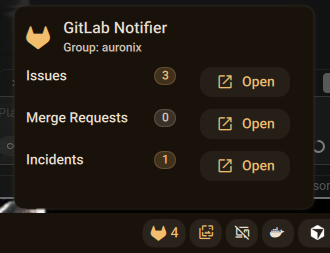

# GitLab Notifier plugin for DankMaterialShell

Shows a compact badge in the DankBar with counts for Issues, Merge Requests and Incidents assigned to the authenticated user (as configured in the `glab` CLI). Includes a popup with a breakdown and quick links to the web UI filtered for the current user.



## Features

- Badge in the bar showing the total count (issues + MRs + incidents)
- Popup with separate counts and "open in browser" links
- Scope can be configured per Group (`--group`) or per Repo (`--repo`)
- Uses the authenticated `glab` user for links (retrieved via `glab api user`)
- Configurable refresh interval and what to count (issues/mrs/incidents)

## Installation

```bash
mkdir -p ~/.config/DankMaterialShell/plugins/
git clone <this-repo-url> gitlabNotifier
```

Then enable the plugin via DMS Settings → Plugins and add the `gitlabNotifier` widget to your DankBar.

## Usage

1. Open DMS Settings (Super + ,)
2. Enable the `GitLab Notifier` plugin
3. Open the plugin settings and set either `Group` (preferred) or `Repo` (fallback)
4. Configure `glab binary` if not simply `glab`
5. The widget will query `glab` periodically (configurable) and update counts

## Settings

- `Group`: optional. If present the plugin uses `--group <value>` for queries and web links.
- `Repo`: optional. Used with `--repo <owner/project>` when Group is not set.
- `glabBinary`: binary name/path (default: `glab`).
- `gitlabWebUrl`: web base URL (default: `https://gitlab.com`) — used to build links.
- `refreshInterval`: seconds between automatic refreshes.
- `Count Issues`, `Count Merge Requests`, `Count Incidents`: toggles to include/exclude categories.

## Files

- `plugin.json` — plugin manifest
- `GitlabNotifierWidget.qml` — main widget and popup implementation
- `GitlabNotifierSettings.qml` — settings UI
- `README.md` — this file

## Permissions

This plugin requests:

- `process` — to run the `glab` CLI  
- `settings_read` / `settings_write` — to read and persist plugin settings

## Requirements

- `glab` CLI installed and configured (authenticated) and available in PATH or referenced via `glabBinary` setting.
- `Font Awesome` (e.g. Font Awesome 6 Free) — required so the plugin icon displays correctly.

## How it works

The plugin executes `glab` commands to obtain counts and user info:

- Check `glab` binary and authentication: `glab auth status`  
- Get authenticated username: `glab api user --output json` (parsed for `username`)  
- Issues count (by repo or group): `glab issue list --repo <repo> --assignee=@me --state opened --output json` (or `--group <group>`)  
- Merge requests count: `glab mr list --repo <repo> --assignee=@me --state opened --output json`  
- Incidents count (when supported): `glab incident list --repo <repo> --assignee=@me --state opened --output json`

The widget parses JSON, supports NDJSON and numeric output, and falls back gracefully if `incident` command is not available.

## Troubleshooting

- If counts are zero but the CLI shows results, check `glabBinary` setting and ensure `glab` works in a terminal: `glab issue list --group <group> --assignee=@me --output json`  
- If `glab` is not authenticated, run: `glab auth login`
- If your `glab` version lacks `incident`, the incidents count will be skipped and a warning will be shown in the popup.
