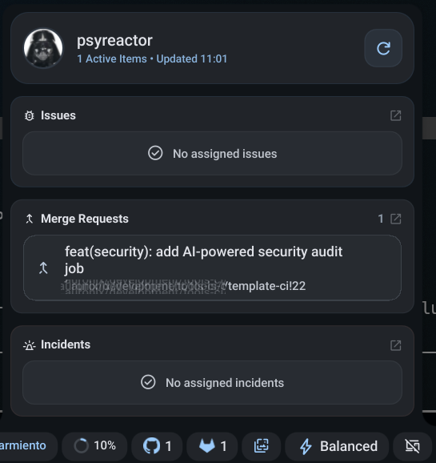

# GitLab Notifier plugin for DankMaterialShell

Shows a compact badge in the DankBar with counts for Issues, Merge Requests and Incidents assigned to the authenticated user (as configured in the `glab` CLI). Includes a popup with a breakdown and quick links to the web UI filtered for the current user.



## Features

- Badge in the bar showing the total count (issues + MRs + incidents)
- Popup header card with your GitLab avatar, username, active item count and the
  time of the last refresh
- One card per category — issues, merge requests, incidents — each listing the
  actual items with their reference, clickable to open in the browser, and with
  its own header linking to the filtered view on GitLab
- Lists scroll, with their own scrollbar, past three items
- Manual refresh with a spinner that tracks the real `glab` calls, and a toast
  when it completes
- If your `glab` has no incident support, the incidents card says so rather than
  taking over the popup's error banner
- Scope can be configured per Group (`--group`) or per Repo (`--repo`)
- Uses the authenticated `glab` user for links (retrieved via `glab api user`)
- Configurable refresh interval, time format, and what to count

## Installation

```bash
mkdir -p ~/.config/DankMaterialShell/plugins/
git clone <this-repo-url> gitlabNotifier
```

Then enable the plugin via DMS Settings → Plugins and add the `gitlabNotifier` widget to your DankBar.

## Usage

1. Open DMS Settings (Super + ,)
2. Enable the `GitLab Notifier` plugin
3. Open the plugin settings and set either `Group` (preferred) or `Repo` (fallback)
4. Configure `glab binary` if not simply `glab`
5. The widget will query `glab` periodically (configurable) and update counts

## Settings

- `Group`: optional. If present the plugin uses `--group <value>` for queries and web links.
- `Repo`: optional. Used with `--repo <owner/project>` when Group is not set.
- `glabBinary`: binary name/path (default: `glab`).
- `gitlabWebUrl`: web base URL (default: `https://gitlab.com`) — used to build links.
- `refreshInterval`: seconds between automatic refreshes. Values below 15 are
  clamped to 15.
- `Show Issues`, `Show Merge Requests`, `Show Incidents`: toggles to
  include/exclude each category.
- `Time Format`: how the last-updated time is rendered in the popup header —
  system default, 12-hour or 24-hour.

## Files

- `plugin.json` — plugin manifest
- `GitlabNotifierWidget.qml` — main widget and popup implementation
- `GitlabNotifierSettings.qml` — settings UI
- `gitlab.svg` — bundled GitLab icon used in the bar and popup header
- `README.md` — this file

## Permissions

This plugin requests:

- `process` — to run the `glab` CLI  
- `settings_read` / `settings_write` — to read and persist plugin settings

## Requirements

- `glab` CLI installed and configured (authenticated) and available in PATH or referenced via `glabBinary` setting.

## How it works

The plugin executes `glab` commands, in this order:

- Check the `glab` binary: `glab --version`
- Check authentication: `glab auth status`
- Probe for incident support: `glab incident --help`
- Get the authenticated username and avatar: `glab api user --output json`
- Issues: `glab issue list --group <group> --assignee=@me --output json`
- Merge requests: `glab mr list --group <group> --assignee=@me --output json`
- Incidents, when supported: `glab incident list --group <group> --assignee=@me --output json`

The three list queries take `--repo <owner/project>` instead of `--group` when
Group is not configured. The widget parses JSON as an array, an object with an
`items` or `data` array, or NDJSON.

Refreshes are serialised: while one is in flight another is queued rather than
run in parallel, and a watchdog clears the in-flight state if a command never
returns.

Each widget instance owns its commands: with the widget on more than one bar, or
on more than one monitor, the instances query independently and never share a
result. Work still in flight when a bar is reconfigured or the plugin is
reloaded is discarded rather than applied to a torn-down widget.

## Troubleshooting

- If counts are zero but the CLI shows results, check `glabBinary` setting and ensure `glab` works in a terminal: `glab issue list --group <group> --assignee=@me --output json`  
- If `glab` is not authenticated, run: `glab auth login`
- If your `glab` version lacks `incident`, the incidents card says so and the
  category is skipped. The popup's error banner stays free for failures that
  block the whole refresh.

## Contributors

- [Thomas Philippot (@Thomas-Philippot)](https://github.com/Thomas-Philippot) — issue/MR/incident lists in the popup; username and avatar in the header
